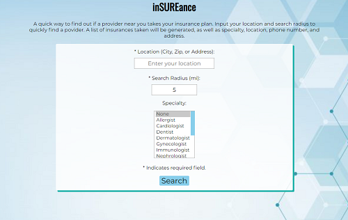
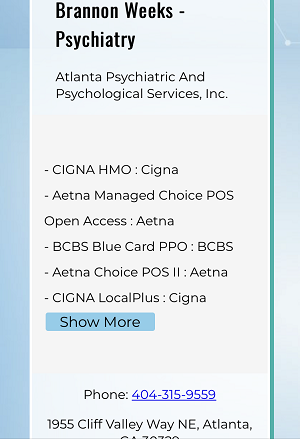
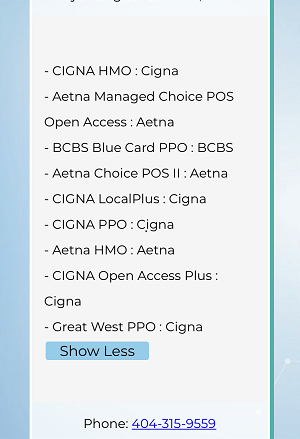

# **inSUREance**
[Link to Live App](https://juliawithers.github.io/insurance-app/)\
[Link to Repo](https://github.com/juliawithers/insurance-app)\
## **What is inSUREance meant to do?**
The primary purpose of this app is to find a doctor near your location and have all insurances listed immediately. The idea is to have it be very simple and have little user input. The data used is from BetterDoctor API and the geocoding api used is from the Mapquest Geocoding API.

The idea for this app stemmed from personal experiences in the healthcare industry and the difficulty in finding information up front about providers. In particular the specific insurances taken. Often you have to click through several pages of their websites to find any insurance information, and even then most of the time you must call to confirm. I hope to expand the app in the future to include filtering by a certain insurance plan and add a map feature. 

## **Important Screenshots**
**Landing Page**\
Enter user location (required), search radius (required), and select a specialty if desired.\
\
**Loaded Results**\
View results loaded by distance from user location.\
\
**Show More/Show Less Button**\
The button allows for more results or less results to be shown.\
      

## **Technology Used**
HTML/CSS/JavaScript/jQuery